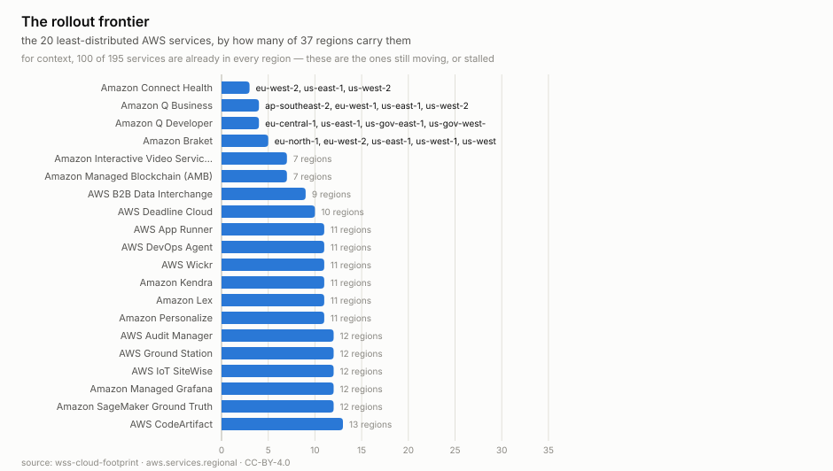
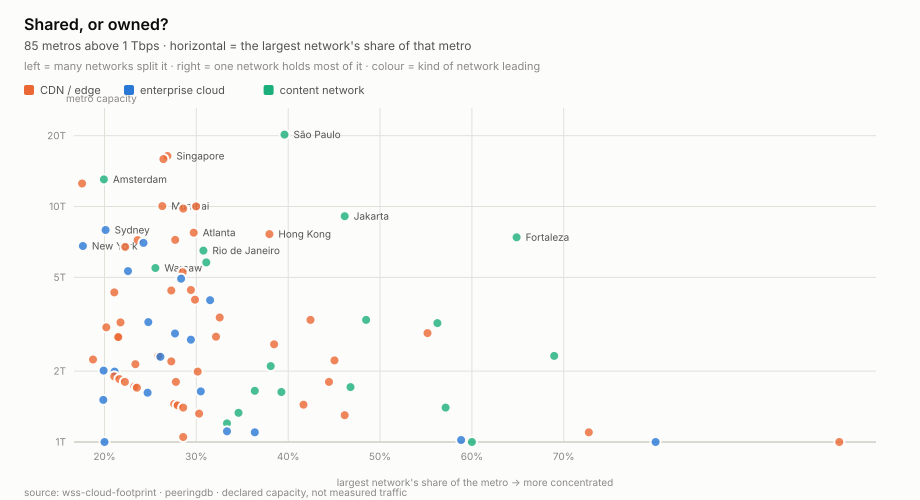
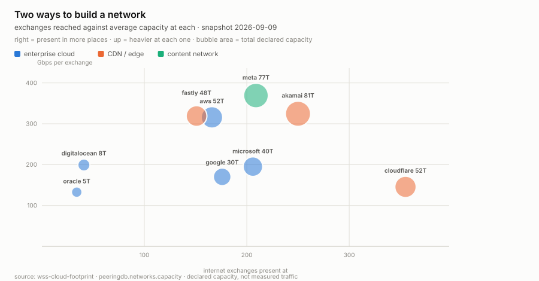
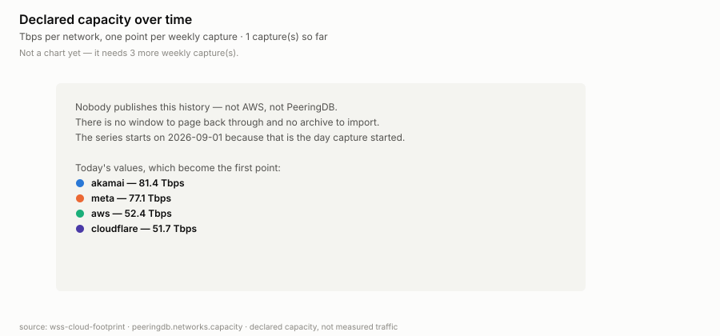
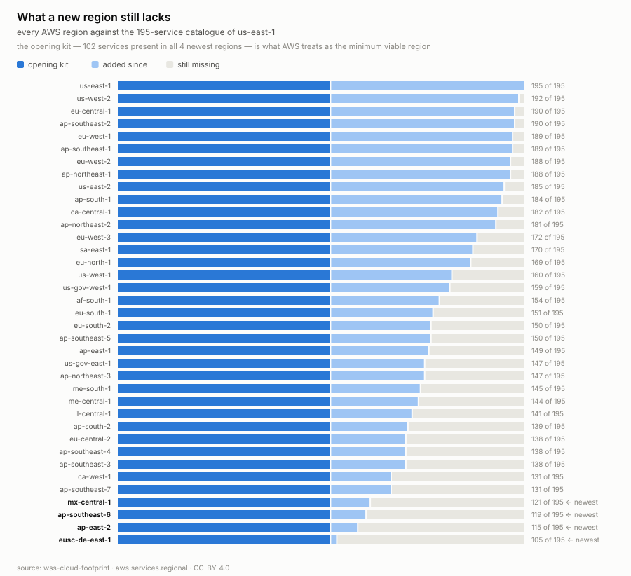

# wss-cloud-footprint — Cloud Footprint History

Weekly point-in-time capture of **where AWS has actually built things**:
which services are live in which regions, and how many IP prefixes each
region and service carries.

AWS publishes only the *current* table. There is no historical version, so
**the date a service reached a region is unrecoverable after the fact** —
unless someone was writing it down. This repo writes it down.

> **Not just AWS.** Interconnection capacity now covers nine networks —
> AWS, Google, Microsoft, Cloudflare, Fastly, Meta, Oracle, DigitalOcean and
> Akamai — anchored to the metro of each internet exchange.
>
> The first capture already upends the hyperscaler framing: **Akamai declares
> 81.4 Tbps and Meta 77.1, both ahead of AWS at 52.4**, and Cloudflare reaches
> more exchanges (355) than anyone. Judged by IP ranges the CDNs looked
> trivial; judged by where they actually plug in, they are the largest.
>
> São Paulo leads all metros at 20.2 Tbps combined. Singapore, Amsterdam,
> Frankfurt and Mumbai are the only metros where **all nine** are present.


### Public peering only — this systematically undercounts enterprise clouds

PeeringDB records **public** interconnection: ports on internet exchanges.
Enterprise cloud traffic disproportionately travels over **private**
interconnects — AWS Direct Connect, Azure ExpressRoute, Google Cloud
Interconnect, and private network interconnects inside datacenters. None of
that appears here, and nobody publishes it.

So the ranking is not "who moves the most bytes". Content and edge networks
(Meta, Akamai, Cloudflare, Fastly) push video and images to consumer eyeballs,
which is exactly the traffic that belongs on public exchanges — so they rank
high, correctly. Enterprise clouds serve business traffic that often bypasses
exchanges entirely, so their true footprint is larger than these numbers show.

Read the figures as **"declared public interconnection capacity"**, which is a
real and comparable quantity, and never as total bandwidth or as traffic.

## Research questions

The point of this repo is the questions, not the folders. Every source below
exists to answer one; a source that answers none should be dropped, and a
question nothing answers is the next thing to build. **Append freely** — an
open question with no data is a useful entry, not a gap to hide.

Status is one of: **open** (nothing captured yet) · **accruing** (captured,
needs more weeks) · **answerable** (enough history exists) · **answered**
(with the finding linked).

| # | Question | Status | Answered by |
| --- | --- | --- | --- |
| Q1 | When a provider opens a region, how long until it reaches service parity — and which regions never do? | accruing (needs ~12 weeks) | `aws.services.regional` |
| Q2 | Which services **stall**? A service stuck in few regions for months is being quietly abandoned, which matters if you depend on it. | accruing (needs ~12 weeks) | `aws.services.regional` |
| Q3 | Is an advertised region count backed by real infrastructure, or is it a press release? Oracle advertises 56 regions to AWS's 37 — but AWS's largest carries 195 services. | **partly answerable** — declared capacity now covers 9 vendors | `peeringdb.networks.capacity` |
| Q8 | Where is interconnection capacity concentrated, and which metros does a vendor skip? A DR region with one vendor present is not multi-cloud. | answerable now | `peeringdb.*` |
| Q9 | Is capacity growth leading or trailing region launches — do the ports arrive before the services? | accruing | `peeringdb.networks.capacity` + `aws.services.regional` |
| Q4 | **Where is accelerator capacity going?** Which regions get GPU/TPU instance types first, and how fast do they spread? | **blocked** — no public unauthenticated source found; see below | nothing yet |
| Q5 | Does network address space lead or lag service availability? Does a region get addresses before it gets services? | accruing | `aws.infra.ip-ranges` + `aws.services.regional` |
| Q6 | What is the **opening kit** — the services AWS treats as the minimum viable region — and is it growing? | answerable now (102 services) | `aws.services.regional` (`available`) |
| Q7 | For a given region, exactly which services are missing? The deployability question. | answerable now | `aws.services.regional` (`available`) |

### When to extend the registry

One test: **which open question does this source close?** If the answer is
"none", the source does not go in — add the question first and justify it, or
drop the idea. That rule is what stopped this repo from collecting four more
vendors' IP-range files, which were easy to fetch and would have answered
nothing.

By that test the remaining work is narrow:

- **Q3** needs per-region service depth for a second vendor. Azure publishes a
  products-by-region page (HTML, ~168 KB); GCP's regions page redirects. Both
  need `wss explore` to find a JSON endpoint behind them.
- **Q4** needs instance-type catalogues, and is blocked on credentials — see
  below.
- **Q8/Q9** are already served by the PeeringDB sources; they need weeks, not
  new endpoints.

Everything else — more IP ranges, facility records at 5.7 MB a week, status
pages that vendors already archive — fails the test today.

### Q4 is blocked, and that is worth recording

Instance types per region are not publicly available without credentials.
AWS's EC2 pricing `region_index.json` is small (18 KB, 106 regions) but only
points at per-region offer files that run to hundreds of megabytes each — not
capturable weekly. The EC2 `DescribeInstanceTypeOfferings` API answers it
exactly, but needs AWS credentials. That is now possible (the engine supports
`auth: {bearer_env: …}`), so Q4 is a decision about whether to run this with
an AWS read-only key, not a dead end.

### A note on what this repo deliberately does *not* chase

IP prefix counts are **allocation, not utilisation** — a provider can announce
a large block and use a fraction of it. They are captured only because Q5 is a
genuine question about sequencing, and because AWS never republishes them.
They are not a proxy for capacity, and this repo will not present them as one.

Several vendors publish IP ranges in near-identical shape (GCP, Oracle,
Linode, DigitalOcean), which makes multi-vendor capture *easy*. Easy is not a
reason. Cloudflare and Fastly publish ~400 bytes of aggregate CIDR with no
location at all, so capturing them would answer nothing; Heroku runs on AWS,
so its footprint is already counted here. The multi-vendor work that would
actually pay is **Q3 and Q4** — service depth and instance types per vendor —
not more address space.

## Why this is a signal, not trivia

A new `(service, region)` pair appearing means AWS stood that service up in
that place. Watched over months, that yields things AWS does not publish:

- **Rollout curves per service** — how long a service takes to go from launch
  region to broad availability, and which services never make it.
- **Region maturity** — a new region's service count climbing toward parity,
  which is a capex-commitment tell.
- **Regional strategy** — which services land first in a sovereign or
  emerging region, revealing what that region is being built *for*.
- **Network build-out** — IP prefix growth per region, independent of the
  service table.

The first capture already shows the spread: `us-east-1` carries all 195
services while the newest regions carry ~105.





**Saturation at the core, dominance at the edge.** Across 85 metros above
1 Tbps the median leader holds 29%, but the spread is the finding: Amsterdam,
Frankfurt and Sydney sit near 18-20% with all nine networks present, while
Fortaleza (65%) and Jakarta (46%) are effectively one network's territory —
Meta's in both cases. If your disaster-recovery metro is on the right-hand
side, it is not really multi-vendor.



Same total capacity can be spread thin or stacked deep, and that is a
strategy choice. **Cloudflare reaches 355 exchanges at ~146 Gbps each**;
Meta reaches 209 at ~369. Akamai does both — most capacity *and* near-Cloudflare
reach. Oracle and DigitalOcean are an order of magnitude smaller on both axes.



That placeholder is deliberate. **Nobody publishes this history** — not AWS,
not PeeringDB. There is no window to page back through and no archive to
import, so the series can only start on the day capture started. The chart
renders itself the moment four weekly captures exist.



Every region ships with the same **102-service opening kit** — what AWS
treats as the minimum viable region — and then accumulates the remaining 93
over years. `eusc-de-east-1`, the European Sovereign Cloud, is 90 services
short of `us-east-1`. If you are choosing where to deploy, that gap is the
answer, and it is only visible because the membership matrix is captured.

Both from [examples/visualize.py](examples/visualize.py), rendered from the
derived table. Even one snapshot is informative: **100 of 195 services are in
all 37 regions**, so the other 95 are mid-rollout — and the 20 thinnest are
where AWS is actively expanding (or where something has quietly stalled).
With weeks of captures these become rollout curves.

## The data

`derived/observations/<YYYY-MM>.csv`, long format:

```
series_id, entity_id, observed_at, captured_at, metric, value, unit, source_id, raw_ref, parser_version
```

`entity_id` is namespaced because two kinds of entity share these tables:

| entity_id | metrics |
| --- | --- |
| `region:us-east-1` | `services_available`, `ipv4_prefixes` |
| `service:Amazon S3` | `regions_available`, `ipv4_prefixes` |
| `aws` | `service_region_pairs`, `regions`, `services`, `ipv4_prefixes_total`, `ipv6_prefixes_total` |

Both sources use the same namespacing on purpose, so they join on
`entity_id`.

```bash
head derived/observations/*.csv
python examples/load_observations.py
duckdb -c "SELECT * FROM read_csv_auto('derived/observations/*.csv') LIMIT 5"
```

## Coverage

Machine-readable in [health/health.csv](health/health.csv)
(`first_success_at` → `last_success_at`).

| series | what it lists | covered since | status |
| --- | --- | --- | --- |
| `aws.services.regional` | every (service, region) pair AWS lists as available | 2026-09-01 | ongoing |
| `aws.infra.ip-ranges` | AWS's published IPv4/IPv6 prefixes by region and service | 2026-09-01 | ongoing |

A new series gets a row with its start date; a discontinued one keeps its row
with a *covered until* date. Nothing published is ever removed.

## Notes on the sources

Both payloads are **set membership** — rows with no numbers in them. The
measurement is therefore an aggregate (how many services a region carries),
so the parsers count rather than read. That is a different parser shape from
a metrics feed, and worth knowing before writing one.

`ip-ranges.json` carries a `syncToken` — AWS's own publication timestamp —
so those observations use it as `observed_at` rather than capture time. The
gap between the two is real: the first capture recorded a file AWS published
about four hours earlier.

Cadence is **weekly**, not daily: regions and services move slowly, and the
cadence should match the decision cycle rather than the polling temptation.

## How it runs

`capture-weekly` (Mondays 22:25 UTC) → `health` → `derive`, all powered by
the [wss](https://github.com/neldivad/wss-engine) engine pinned to one
version. No workflow names a source; capture shards whatever `registry/`
marks active. Adding a source is one new file in `registry/`.

## Licences

Code MIT ([LICENSE](LICENSE)); data CC-BY-4.0 ([LICENSE-DATA](LICENSE-DATA)).
Captured content comes from public AWS endpoints and remains subject to the
[AWS service terms](https://aws.amazon.com/service-terms/).

Topics: `git-scraping` · `open-data` · `point-in-time-data` · `dataset`
