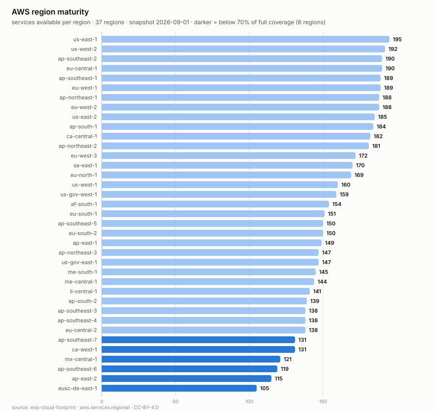

# wss-cloud-footprint — Cloud Footprint History

Weekly point-in-time capture of **where AWS has actually built things**:
which services are live in which regions, and how many IP prefixes each
region and service carries.

AWS publishes only the *current* table. There is no historical version, so
**the date a service reached a region is unrecoverable after the fact** —
unless someone was writing it down. This repo writes it down.

## Why this is a signal, not trivia

A new `(service, region)` pair appearing means AWS stood that service up in
that place. Watched over months, that yields things AWS does not publish:

- **Rollout curves per service** — how long a service takes to go from launch
  region to broad availability, and which services never make it.
- **Region maturity** — a new region's service count climbing toward parity,
  which is a capex-commitment tell.
- **Regional strategy** — which services land first in a sovereign or
  emerging region, revealing what that region is being built *for*.
- **Network build-out** — IP prefix growth per region, independent of the
  service table.

The first capture already shows the spread: `us-east-1` carries all 195
services while the newest regions carry ~105.




Both from [examples/visualize.py](examples/visualize.py), rendered from the
derived table. Even one snapshot is informative: **100 of 195 services are in
all 37 regions**, so the other 95 are mid-rollout — and the 20 thinnest are
where AWS is actively expanding (or where something has quietly stalled).
With weeks of captures these become rollout curves.

## The data

`derived/observations/<YYYY-MM>.csv`, long format:

```
series_id, entity_id, observed_at, captured_at, metric, value, unit, source_id, raw_ref, parser_version
```

`entity_id` is namespaced because two kinds of entity share these tables:

| entity_id | metrics |
| --- | --- |
| `region:us-east-1` | `services_available`, `ipv4_prefixes` |
| `service:Amazon S3` | `regions_available`, `ipv4_prefixes` |
| `aws` | `service_region_pairs`, `regions`, `services`, `ipv4_prefixes_total`, `ipv6_prefixes_total` |

Both sources use the same namespacing on purpose, so they join on
`entity_id`.

```bash
head derived/observations/*.csv
python examples/load_observations.py
duckdb -c "SELECT * FROM read_csv_auto('derived/observations/*.csv') LIMIT 5"
```

## Coverage

Machine-readable in [health/health.csv](health/health.csv)
(`first_success_at` → `last_success_at`).

| series | what it lists | covered since | status |
| --- | --- | --- | --- |
| `aws.services.regional` | every (service, region) pair AWS lists as available | 2026-09-01 | ongoing |
| `aws.infra.ip-ranges` | AWS's published IPv4/IPv6 prefixes by region and service | 2026-09-01 | ongoing |

A new series gets a row with its start date; a discontinued one keeps its row
with a *covered until* date. Nothing published is ever removed.

## Notes on the sources

Both payloads are **set membership** — rows with no numbers in them. The
measurement is therefore an aggregate (how many services a region carries),
so the parsers count rather than read. That is a different parser shape from
a metrics feed, and worth knowing before writing one.

`ip-ranges.json` carries a `syncToken` — AWS's own publication timestamp —
so those observations use it as `observed_at` rather than capture time. The
gap between the two is real: the first capture recorded a file AWS published
about four hours earlier.

Cadence is **weekly**, not daily: regions and services move slowly, and the
cadence should match the decision cycle rather than the polling temptation.

## How it runs

`capture-weekly` (Mondays 22:25 UTC) → `health` → `derive`, all powered by
the [wss](https://github.com/neldivad/wss-engine) engine pinned to one
version. No workflow names a source; capture shards whatever `registry/`
marks active. Adding a source is one new file in `registry/`.

## Licences

Code MIT ([LICENSE](LICENSE)); data CC-BY-4.0 ([LICENSE-DATA](LICENSE-DATA)).
Captured content comes from public AWS endpoints and remains subject to the
[AWS service terms](https://aws.amazon.com/service-terms/).

Topics: `git-scraping` · `open-data` · `point-in-time-data` · `dataset`
